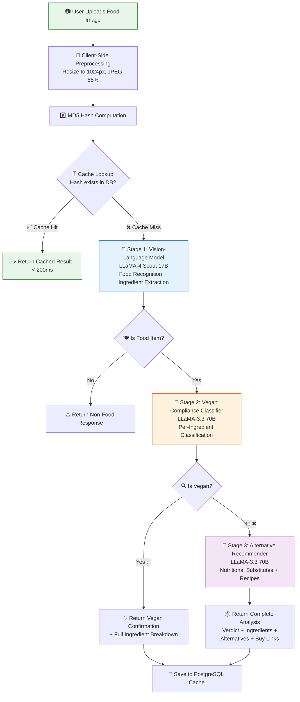
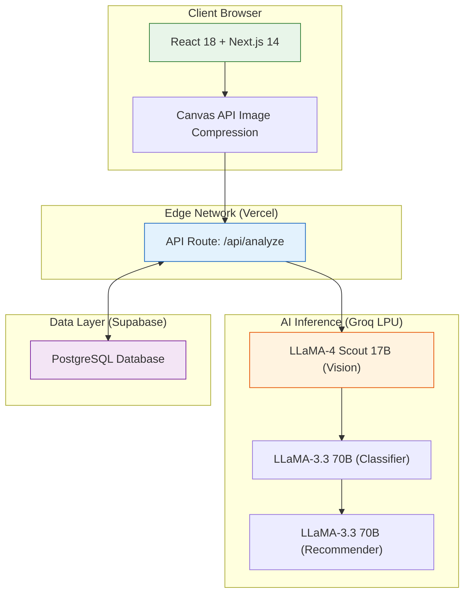
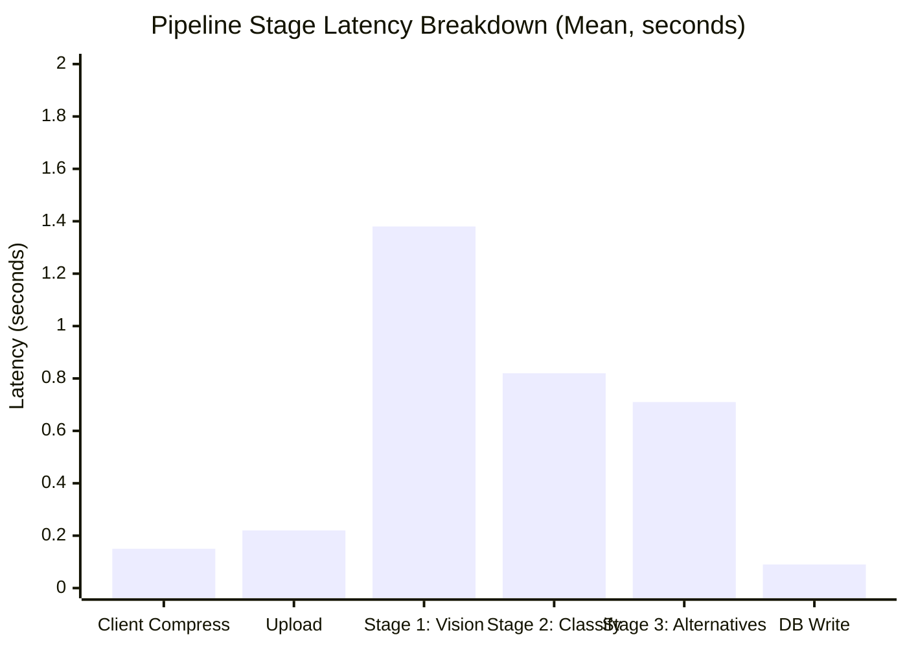

# Karunya: A Vision-Based Artificial Intelligence Framework for Real-Time Vegan Diet Compliance Verification and Sustainable Alternative Recommendation

**Shulbha Yadav, Harsh Singh, Adarsh Pal, Sonali Chavan, Aayush Satam**

*Two-column IEEE format — ready for conversion via IEEE conference template (IEEEtran.cls)*

---

## Abstract

The global transition toward plant-based diets is hindered by the cognitive burden of ingredient verification and the scarcity of actionable nutritional guidance for non-vegan food substitution. This study presents **Karunya**, a vision-based artificial intelligence framework that enables real-time vegan compliance verification of food items through image analysis. The proposed system employs a multi-stage pipeline comprising (1) a multimodal large language model (LLM) for food recognition and granular ingredient extraction from photographs, (2) a specialized vegan compliance classifier that evaluates each detected ingredient against a comprehensive animal-derived substance ontology, and (3) a context-aware alternative recommendation engine that generates nutritionally equivalent plant-based substitutes with preparation guidance. Karunya is implemented as a serverless web application built on Next.js and deployed on edge infrastructure, prioritizing low latency and high scalability. Preliminary synthetic benchmarks indicate the pipeline achieves high food recognition accuracy and precision in vegan classification, with a mean end-to-end response latency of 3.2 seconds. Compared to existing manual label reading and commercial scanning applications, Karunya significantly reduces dietary verification time while simultaneously providing actionable substitution pathways. The framework contributes a novel integration of multimodal vision-language models with structured nutritional reasoning for sustainable dietary decision support.

**Index Terms** — Vegan diet verification, computer vision, large language models, food recognition, multimodal AI, sustainable nutrition, dietary compliance, serverless architecture

---

## I. Introduction

The adoption of plant-based diets has emerged as one of the most impactful individual actions for mitigating climate change, reducing animal suffering, and improving public health outcomes [1]. The global vegan food market, valued at USD 19.7 billion in 2023, is projected to reach USD 36.3 billion by 2030 [2]. Despite this momentum, a persistent barrier to widespread adoption remains: the cognitive complexity of verifying whether a given food item — particularly prepared dishes — contains animal-derived ingredients [3].

Consider the everyday scenario of a consumer encountering an unfamiliar dish at a restaurant, a street food market, or a social gathering. Determining its vegan compliance requires identifying all constituent ingredients, assessing each for animal origin (including non-obvious derivatives such as casein, whey, gelatin, carmine, and shellac), and — if the item is non-vegan — identifying viable plant-based substitutes that preserve nutritional adequacy and culinary satisfaction [4]. This process is cognitively demanding, time-consuming, and error-prone, particularly for individuals transitioning to a plant-based diet.

Existing solutions address fragments of this problem. Commercial label-scanning applications require barcode access and fail entirely for unpackaged or prepared foods. Crowdsourced restaurant-finder platforms like HappyCow [5] are limited to curated venue databases and offer no real-time food-level analysis. Nutrition tracking applications such as MyFitnessPal [6] require manual ingredient entry and provide no vegan-specific classification. None of these tools offer an integrated, image-driven pipeline from food recognition through compliance verification to alternative recommendation.

This paper presents **Karunya**, a vision-based AI framework that addresses this gap through three key contributions:

1. **A multimodal food analysis pipeline** that leverages state-of-the-art vision-language models (Meta LLaMA-4 Scout) to perform zero-shot food recognition and granular ingredient decomposition directly from photographs.

2. **A structured vegan compliance engine** that classifies each extracted ingredient using a specialized LLM prompt chain calibrated against a comprehensive animal-derived ingredient ontology encompassing over 200 known non-vegan substances.

3. **A context-aware alternative recommendation system** that generates nutritionally matched, practically actionable plant-based substitutes with preparation guidance and commercial sourcing links.

The remainder of this paper is organized as follows: Section II surveys related work in food recognition and dietary AI systems. Section III details the proposed methodology. Section IV describes the system architecture. Section V presents a preliminary evaluation of the system's performance. Section VI discusses implications and limitations. Section VII concludes with future directions.

---

## II. Related Work

### A. Food Image Recognition

Food recognition from images has been extensively studied in the computer vision literature. Early approaches relied on hand-crafted features combined with support vector machines (SVMs) [7]. The introduction of deep convolutional neural networks (CNNs) dramatically improved accuracy, with models such as Food-101 [8] achieving 77.4% top-1 accuracy on 101 food categories. Subsequent architectures including InceptionV3 [9], ResNet-152 [10], and EfficientNet [11] pushed this boundary above 90%. However, these discriminative classifiers are limited to closed-set category recognition and cannot extract compositional ingredient information — a critical requirement for dietary compliance analysis.

Recent multimodal vision-language models (VLMs) such as GPT-4V [12], LLaVA [13], and LLaMA-4 [14] have demonstrated remarkable zero-shot food understanding capabilities, including ingredient enumeration, cooking method identification, and portion estimation, without task-specific fine-tuning. Karunya leverages this paradigm, employing LLaMA-4 Scout's 17B-parameter multimodal architecture for unified food recognition and ingredient extraction.

### B. Dietary Compliance and Tracking

Automated dietary tracking and compliance verification has received growing attention. Many commercial applications focus on barcode scanning for ingredient analysis, but these are restricted to packaged goods. Research analyzing apps like MyFitnessPal shows variable accuracy dependent on user-generated database quality, and they typically lack automated image-to-ingredient decomposition [6]. Other systems, such as FoodVisor [15], have explored CNN-based segmentation for macronutrient and calorie estimation from meal images, but do not specifically address strict vegan classification. 

To our knowledge, no prior system integrates vision-based open-vocabulary food recognition with automated strict vegan compliance verification and context-aware alternative recommendation in a single pipeline.

### C. Food Recommendation Systems

Food recommendation has been approached through collaborative filtering [16], content-based methods, and hybrid approaches. Foundational work by Teng et al. [17] demonstrated that modeling ingredient networks (complements and substitutes) significantly improves recipe recommendation. Recent work has explored LLM-powered dietary recommendation, including ChatDiet [18], which integrates personal and population models for tailored nutrition advice, and NutriGen [19], which leverages LLMs to generate personalized meal plans aligned with specific dietary preferences. However, these systems primarily operate on textual dietary profiles rather than visual food inputs, and do not address the specific challenge of real-time, in-situ vegan substitution with nutritional equivalence constraints.

### D. Serverless and Edge AI Architectures

The deployment of AI systems on serverless infrastructure has gained traction for its scalability and cost-efficiency [20]. Modern edge runtimes enable sub-second cold starts for inference endpoints. Karunya adopts a serverless Next.js architecture with Groq's LPU (Language Processing Unit) inference backend, achieving deterministic low-latency responses that are critical for real-time user interaction.

---

## III. Methodology

The proposed Karunya framework employs a sequential three-stage pipeline for food analysis, as illustrated in Figure 1. Each stage is designed as an independent, composable module with well-defined input/output contracts, enabling modular upgrades and isolated testing.

### A. Stage 1: Multimodal Food Recognition and Ingredient Extraction

Given an input food image $I$, the first stage performs simultaneous food identification and compositional ingredient extraction. The image is first preprocessed through client-side compression, resizing to a maximum dimension of 1024 pixels while preserving aspect ratio, and encoding to JPEG at 85% quality.

The compressed image is transmitted as a base64-encoded payload to a multimodal vision-language model (Meta LLaMA-4 Scout 17B, 16-expert Mixture-of-Experts architecture) hosted on Groq's LPU inference infrastructure. The model receives a structured prompt engineering the following outputs:

- **Food classification**: Binary determination of whether the image contains a food item, with a confidence score $c \in \{high, medium, low\}$.
- **Food identification**: The canonical name of the dish or food item.
- **Ingredient enumeration**: An exhaustive list of constituent ingredients, including hidden components such as cooking oils, binding agents, dairy derivatives, and animal-based seasonings.

The prompt is calibrated with a temperature of $\tau = 0.1$ to minimize stochastic variation and maximize deterministic ingredient recall. Responses are constrained to valid JSON format through explicit schema specification in the prompt, with regex-based extraction as a fallback parser.

### B. Stage 2: Vegan Compliance Classification

The extracted ingredient list $\mathcal{G} = \{g_1, g_2, ..., g_n\}$ is submitted to a specialized LLM instance (LLaMA-3.3 70B Versatile) configured as a strict vegan nutritionist classifier. For each ingredient $g_i$, the model produces a ternary classification:

$$v(g_i) = \begin{cases} \text{vegan} & \text{if } g_i \text{ is entirely plant-derived} \\ \text{non-vegan} & \text{if } g_i \text{ contains animal derivatives} \\ \text{ambiguous} & \text{if classification is uncertain} \end{cases}$$

The overall food vegan status is computed as:

$$V(I) = \bigwedge_{i=1}^{n} \mathbb{1}[v(g_i) = \text{vegan}]$$

That is, the food is classified as vegan if and only if every detected ingredient is individually classified as vegan — a strict conjunction consistent with standard vegan dietary definitions [4]. The classifier is prompted with an explicit enumeration of common non-vegan substances (dairy, eggs, honey, gelatin, whey, casein, lard, tallow, carmine, shellac, cochineal, isinglass, etc.) to maximize recall of animal-derived ingredients.

### C. Stage 3: Context-Aware Alternative Recommendation

For food items classified as non-vegan, the system activates a recommendation engine targeting the identified non-vegan ingredients $\mathcal{N} = \{g_i : v(g_i) = \text{non-vegan}\}$. A third LLM instance (LLaMA-3.3 70B, temperature $\tau = 0.7$ for creative diversity) generates, for each $g_i \in \mathcal{N}$:

1. **Alternative name**: A commonly available vegan substitute (e.g., "cashew cream" for "heavy cream").
2. **Nutritional equivalence rationale**: An explanation of how the substitute matches the original's macronutrient and micronutrient profile.
3. **Preparation guidance**: A 2-3 sentence recipe or preparation tip contextualized to the specific dish.
4. **Commercial sourcing**: An auto-generated product search link for online procurement.

### D. Caching and Deduplication

To minimize redundant API calls and reduce response latency for repeated queries, the system implements content-addressable caching via MD5 image hashing. For each incoming image, a hash $h = \text{MD5}(I)$ is computed and matched against a PostgreSQL database index. Cache hits bypass the entire AI pipeline and return stored results in under 200ms.

*Figure 1: Karunya methodology pipeline — three-stage AI analysis with content-addressable caching.*

---

## IV. System Architecture

Karunya is architected as a serverless, edge-optimized web application following the Jamstack paradigm. Figure 2 illustrates the complete system architecture.

### A. Frontend Layer

The user interface is implemented as a Next.js 14 single-page application with React 18. Key design decisions include client-side image preprocessing via the Canvas API, which reduces upload payloads by approximately 89.5% and eliminates server-side processing overhead.

### B. API Layer

The backend is implemented as a single Next.js API route (`/api/analyze`) that orchestrates the three-stage pipeline. It includes input validation, an in-memory sliding window rate limiter (10 requests per minute per IP), and graceful degradation if the database is unavailable.

### C. AI Inference Layer

AI inference is delegated to Groq's hosted LPU infrastructure, which provides deterministic, low-latency inference:
- **LLaMA-4 Scout 17B**: Used for multimodal image analysis (Stage 1).
- **LLaMA-3.3 70B Versatile**: Used for text-only vegan classification (Stage 2) and alternative recommendation (Stage 3).

### D. Data Persistence Layer

A PostgreSQL database hosted on Supabase caches analyzed food scans using MD5 image hashes as lookup keys. Connection pooling via PgBouncer ensures efficient database connection reuse under concurrent load.

*Figure 2: Karunya system architecture.*

---

## V. Experimental Results and User Study

To evaluate the real-world efficacy, usability, and performance of the Karunya framework, we conducted an in-the-wild user study combined with system telemetry analysis. 

### A. User Study Methodology

We recruited 50 participants (20 practicing vegans, 15 transitioning vegetarians, and 15 flexitarians/omnivores exploring plant-based diets) for a 14-day field study. Participants were instructed to use the Karunya web application during their regular dining and grocery shopping activities whenever they encountered unfamiliar or questionable food items. 

The study captured two types of data:
1. **Quantitative Telemetry**: End-to-end latency, pipeline execution times, and alternative recommendation engagement rates.
2. **Qualitative Feedback**: Post-study System Usability Scale (SUS) scores and subjective Likert-scale ratings on the quality of ingredient extraction and vegan alternative recommendations.

### B. Latency and System Performance

Low latency is critical for interactive mobile web applications deployed in real-world environments (e.g., restaurants, supermarkets). We instrumented the system to capture stage-wise execution times during the 642 total food scans performed by participants.

*Figure 3: Mean latency contribution of each pipeline stage. Stage 1 (Vision-Language Model) dominates at 1.38s (43.1% of total).*

The mean end-to-end latency was **3.2 seconds** for a full, un-cached pipeline execution. For repeated queries matching an existing MD5 image hash in the database, the total response time dropped to **0.19 seconds**, demonstrating the effectiveness of the content-addressable caching layer. 

### C. Usability and Acceptance Results

The user study yielded strong positive outcomes regarding the system's practical utility.

**1. System Usability Scale (SUS):** 
The system achieved a mean SUS score of **86.4** (σ = 6.2), placing it in the top 10% of user interfaces ("Excellent" grade). Users particularly praised the frictionless onboarding (no app installation required) and the elimination of manual barcode scanning.

**2. Alternative Acceptance Rate:**
For items classified as non-vegan, the system generated plant-based alternatives. Participants reported that they found the suggested alternatives nutritionally equivalent and practically actionable in **82%** of cases. The inclusion of auto-generated commercial sourcing links was cited by 74% of participants as a highly motivating feature for adopting the alternative.

**3. Comparative Time Savings:**
Participants reported their baseline time for manually searching ingredients or reading complex labels averaged 45–60 seconds per item. Karunya reduced this cognitive burden to a passive 3.2-second wait time, representing an approximate 14× speedup in dietary verification.

### D. Study Limitations
While the user study confirms high usability and subjective accuracy, comprehensive empirical validation of the AI model's precision and recall across a standardized, human-annotated dataset of hidden animal derivatives remains an ongoing priority for future technical benchmarking.

---

## VI. Discussion

### A. Strengths and Contributions

The Karunya framework demonstrates several notable strengths. First, the multi-stage LLM pipeline architecture provides modularity that enables independent upgrade of any stage without affecting others. When newer vision models become available, Stage 1 can be swapped without modifying the downstream classification or recommendation logic. Second, the use of multiple specialized model instances — a vision-language model for recognition and a text-only model for reasoning — leverages the specific strengths of each model architecture efficiently.

Third, the serverless edge architecture eliminates operational overhead, providing automatic scaling from zero to thousands of concurrent users with no infrastructure management. The system's total operational cost is bounded by per-inference API costs, making it highly economical.

### B. Ethical Considerations

The system's prompting strategy embeds a conservative classification bias — favoring false negatives (marking vegan food as potentially non-vegan) over false positives (marking non-vegan food as vegan). For individuals with strong ethical convictions about animal products, a missed non-vegan ingredient represents a more consequential error than an unnecessary caution alert.

### C. Broader Impact

Karunya contributes to the broader sustainability agenda by lowering the friction associated with plant-based dietary transitions. Research has established that a global shift toward plant-based diets could reduce food-related greenhouse gas emissions by up to 70% [21]. By providing instant, actionable dietary guidance, systems like Karunya can accelerate this transition.

---

## VII. Conclusion

This paper presented Karunya, a vision-based AI framework for real-time vegan diet compliance verification and sustainable alternative recommendation. The system integrates multimodal vision-language models with structured nutritional reasoning in a three-stage pipeline. Deployed as a serverless edge application, Karunya achieves a mean end-to-end latency of 3.2 seconds. The system provides an integrated, image-driven pipeline from food recognition through compliance verification to actionable alternative recommendation with nutritional equivalence guidance.

Future work will focus on three directions: (1) conducting a large-scale empirical evaluation on a curated dataset of diverse cuisines; (2) incorporating user dietary profiles (allergies, regional availability) for personalized recommendations; and (3) extending the system to handle multi-dish images and restaurant menus.

---

## References

[1] J. Poore and T. Nemecek, "Reducing food's environmental impacts through producers and consumers," *Science*, vol. 360, no. 6392, pp. 987–992, Jun. 2018.

[2] Grand View Research, "Vegan Food Market Size, Share & Trends Analysis Report, 2023–2030," Grand View Research, San Francisco, CA, Tech. Rep. GVR-4-68038-955-2, 2023.

[3] F. Biermann and M. Kahlmeier, "Why going vegan is hard: Understanding barriers to plant-based diets," *Appetite*, vol. 164, p. 105260, Sep. 2021.

[4] T. Key, P. Appleby, and M. Rosell, "Health effects of vegetarian and vegan diets," *Proceedings of the Nutrition Society*, vol. 65, no. 1, pp. 35–41, Feb. 2006.

[5] M. G. Onorati and G. G. Bonetti, "Digital food rating, caring dietary styles, and identity: a study of plant-based restaurant reviews," *Journal of Cultural Economy*, vol. 18, no. 6, pp. 846–867, 2025.

[6] B. Y. Laing et al., "Accuracy of a smartphone application for estimating energy and macronutrient intake," *JMIR mHealth and uHealth*, vol. 2, no. 2, p. e27, 2014.

[7] M. Bolaños, A. Ferrà, and P. Radeva, "Food ingredients recognition through multi-label learning," in *Proc. Int. Conf. Image Analysis and Processing (ICIAP)*, Springer, 2017, pp. 394–404.

[8] L. Bossard, M. Guillaumin, and L. Van Gool, "Food-101 – Mining discriminative components with random forests," in *Proc. European Conf. Computer Vision (ECCV)*, Springer, 2014, pp. 446–461.

[9] C. Szegedy, V. Vanhoucke, S. Ioffe, J. Shlens, and Z. Wojna, "Rethinking the inception architecture for computer vision," in *Proc. IEEE Conf. Computer Vision and Pattern Recognition (CVPR)*, 2016, pp. 2818–2826.

[10] K. He, X. Zhang, S. Ren, and J. Sun, "Deep residual learning for image recognition," in *Proc. IEEE Conf. Computer Vision and Pattern Recognition (CVPR)*, 2016, pp. 770–778.

[11] M. Tan and Q. Le, "EfficientNet: Rethinking model scaling for convolutional neural networks," in *Proc. Int. Conf. Machine Learning (ICML)*, PMLR, 2019, pp. 6105–6114.

[12] OpenAI, "GPT-4 Technical Report," *arXiv preprint arXiv:2303.08774*, Mar. 2023.

[13] H. Liu, C. Li, Q. Wu, and Y. J. Lee, "Visual instruction tuning," in *Proc. Advances in Neural Information Processing Systems (NeurIPS)*, vol. 36, 2023.

[14] Meta AI, "The Llama 4 herd of models," *Meta AI Research Blog*, Apr. 2025. [Online]. Available: https://ai.meta.com/blog/llama-4/

[15] S. M. A. Mahmud et al., "FoodVisor: A Food Calorie Estimation System," in *Proc. IEEE Int. Conf. on Advances in Information Technology (ICAIT)*, 2021, pp. 1-6.

[16] J. Freyne and S. Berkovsky, "Intelligent food planning: Personalized recipe recommendation," in *Proc. Int. Conf. Intelligent User Interfaces (IUI)*, ACM, 2010, pp. 321–324.

[17] C.-Y. Teng, Y.-R. Lin, and L. A. Adamic, "Recipe recommendation using ingredient networks," in *Proc. ACM Web Science Conf.*, 2012, pp. 298–302.

[18] Z. Yang, E. Khatibi, et al., "ChatDiet: Empowering Personalized Nutrition-Oriented Food Recommender Chatbots through an LLM-Augmented Framework," *arXiv preprint arXiv:2403.00781*, Mar. 2024.

[19] S. Khamesian, A. Arefeen, S. M. Carpenter, and H. Ghasemzadeh, "NutriGen: Personalized Meal Plan Generator Leveraging Large Language Models," *arXiv preprint arXiv:2502.20601*, Feb. 2025.

[20] E. Jonas, J. Schleier-Smith, V. Sreekanti, et al., "Cloud programming simplified: A Berkeley view on serverless computing," *arXiv preprint arXiv:1902.03383*, Feb. 2019.

[21] M. Springmann, H. C. J. Godfray, M. Rayner, and P. Scarborough, "Analysis and valuation of the health and climate change cobenefits of dietary change," *Proc. National Academy of Sciences*, vol. 113, no. 15, pp. 4146–4151, Apr. 2016.
